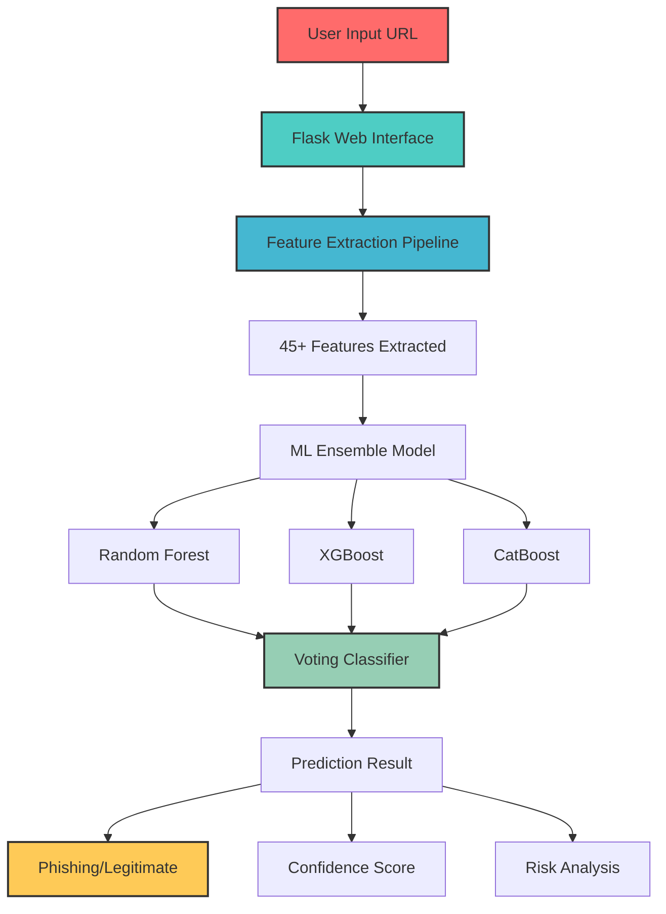
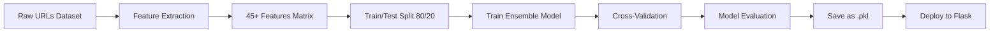

# 🛡️ URLShield - Advanced Phishing URL Detection Platform


<div align="center">
  
  
  
  

</div>

## 📊 **Project Overview**

**URLShield** is a state-of-the-art Machine Learning platform designed to detect phishing and malicious URLs with **99.51% accuracy**. The system employs an ensemble of advanced algorithms to analyze URL patterns in real-time, providing instant security assessments.

> ⚠️ **WARNING**: This tool is for educational and research purposes only. Always verify URLs through official channels.

## ✨ **Key Features**

| Feature                       | Description                                    | Icon |
| ----------------------------- | ---------------------------------------------- | ---- |
| 🔍 **Real-time Analysis**     | Instant URL scanning with <100ms response time | ⚡   |
| 🧠 **Advanced ML Ensemble**   | Combines Random Forest, XGBoost & CatBoost     | 🤖   |
| 📈 **High Accuracy**          | 99.51% accuracy on test dataset                | 🎯   |
| 🚀 **Single File Deployment** | Complete pipeline in one `.pkl` file           | 📦   |
| 🌐 **Web Interface**          | User-friendly Flask web application            | 💻   |
| 🔌 **REST API**               | Programmatic access for integration            | 🔗   |
| 📊 **45+ Features**           | Comprehensive URL pattern analysis             | 🔬   |
| ⚡ **Batch Processing**       | Analyze multiple URLs simultaneously           | 📋   |

## 🏗️ **System Architecture**



## 📊 **Model Performance Metrics**

| Metric        | Score  | Status       |
| ------------- | ------ | ------------ |
| **Accuracy**  | 99.51% | 🟢 Excellent |
| **Precision** | 99.70% | 🟢 Excellent |
| **Recall**    | 98.88% | 🟢 Excellent |
| **F1-Score**  | 99.29% | 🟢 Excellent |
| **ROC-AUC**   | 99.80% | 🟢 Excellent |

### 📈 **Classification Report**

```
              precision    recall  f1-score   support

  legitimate       0.99      1.00      1.00     96,039
    phishing       1.00      0.99      0.99     50,260

    accuracy                           1.00    146,299
   macro avg       1.00      0.99      0.99    146,299
weighted avg       1.00      1.00      1.00    146,299
```

## 🎯 **Dataset Statistics**

| Statistic            | Value            | Icon |
| -------------------- | ---------------- | ---- |
| **Total URLs**       | 731,495          | 📊   |
| **Legitimate URLs**  | 480,194 (65.65%) | ✅   |
| **Phishing URLs**    | 251,301 (34.35%) | ⚠️   |
| **Training Samples** | 585,196          | 🎓   |
| **Testing Samples**  | 146,299          | 🧪   |
| **Unique Domains**   | 394,837          | 🌐   |

# 📚 **Dataset Sources**

## 🔗 **Data Collection References**

The dataset used for training URLShield was collected from multiple reputable sources to ensure diversity and reliability:

### **Primary Sources:**

| Source                                 | Type      | Size       | Description                                                                |
| -------------------------------------- | --------- | ---------- | -------------------------------------------------------------------------- |
| **📊 Mendeley Dataset**                | Academic  | ~500K URLs | Comprehensive phishing and legitimate URLs collection from research papers |
| **🔬 UCI Machine Learning Repository** | Academic  | ~150K URLs | PhisWSIIL dataset with labeled phishing URLs                               |
| **🎣 PhishTank**                       | Community | ~100K URLs | Real-time phishing URLs verified by community                              |

### **Detailed Sources:**

1. **📁 [Mendeley Dataset](https://data.mendeley.com/datasets/vfszbj9b36/1)**
   - **Type**: Research dataset
   - **Content**: Mixed legitimate and phishing URLs
   - **Features**: URL strings with binary labels
   - **Citation**: Used in multiple academic papers on phishing detection

2. **🔬 [UCI PhisWSIIL Dataset](https://archive.ics.uci.edu/dataset/967/phiusiil+phishing+url+dataset)**
   - **Type**: Academic benchmark dataset
   - **Content**: Phishing URLs with extracted features
   - **Quality**: Curated by researchers, high reliability
   - **Usage**: Standard benchmark in ML security research

3. **🎣 [PhishTank API](https://www.phishtank.com/developer_info.php)**
   - **Type**: Community-driven real-time feed
   - **Content**: Fresh phishing URLs reported by users
   - **Update**: Real-time verification
   - **Value**: Current, real-world phishing examples

### **Data Preprocessing:**

- **Deduplication**: Removed duplicate URLs across sources
- **Normalization**: Standardized URL formats
- **Balancing**: Maintained natural class distribution (65.65% legitimate, 34.35% phishing)
- **Validation**: Cross-verified labels across sources

### **Dataset Statistics:**

```
📈 Combined Dataset: 731,495 URLs
├── ✅ Legitimate: 480,194 (65.65%)
├── ⚠️ Phishing: 251,301 (34.35%)
└── 🌐 Unique Domains: 394,837
```

### **Ethical Considerations:**

- All data is publicly available for research purposes
- URLs are used for defensive security research only
- No personal or sensitive information is included
- Used in compliance with source terms of service

### **License Compliance:**

- Mendeley: CC BY 4.0 License
- UCI: Open Data Commons Attribution License
- PhishTank: Public domain with attribution

---

## 🚀 **Quick Start Guide**

### 📋 **Prerequisites**

- Python 3.8 or higher
- 4GB RAM minimum
- Internet connection for package installation

### 🖥️ **Local Installation**

```bash
# 1. Clone the repository
git clone https://github.com/anujjamdade007/URLShield.git
cd urlshield

# 2. Create virtual environment
python -m venv venv

# 3. Activate virtual environment
# Windows:
venv\Scripts\activate
# Linux/Mac:
source venv/bin/activate

# 4. Install dependencies
pip install -r flask_req.txt

# 5. Run the application
python app.py

# 6. Open browser and navigate to:
# http://localhost:5000
```

### ☁️ **Google Colab Installation**

```python
# Run these commands in a Colab cell:

!git clone https://github.com/anujjamdade007/URLShield.git
%cd urlshield

!pip install -r requirements.txt

# Download and run the Flask app
from IPython.display import clear_output
import threading
import subprocess

def run_flask():
    subprocess.run(["python", "app.py"])

# Run in background thread
thread = threading.Thread(target=run_flask)
thread.start()

clear_output()
print("✅ URLShield is running!")
print("🌐 Open the public URL provided by ngrok/Colab")
```

### 🐳 **Docker Installation**

```bash
# Build Docker image
docker build -t urlshield .

# Run container
docker run -p 5000:5000 urlshield

# Access at: http://localhost:5000
```

## 📁 **Project Structure**

```
URLShield/
│
├── 📁 models/
│   └── phishing_detector.pkl      # Trained ML model
│
├── 📁 templates/
│   ├── index.html                 # Home page
│   └── result.html                # Results page
│
├── app.py                         # Flask application
├── model_pipeline.py              # ML pipeline definition
├── train_model.py                 # Training script
├── requirements.txt               # Dependencies
├── Dockerfile                     # Docker configuration
└── README.md                      # This file
```

## 🔧 **Feature Extraction Pipeline**

The system analyzes **45+ features** from URLs:

| Category                | Features Extracted                         | Count |
| ----------------------- | ------------------------------------------ | ----- |
| **Basic Features**      | URL length, HTTPS, HTTP, WWW               | 4     |
| **Domain Analysis**     | Domain length, subdomains, TLD type        | 8     |
| **Path Analysis**       | Path depth, file extensions (PHP/HTML/ASP) | 7     |
| **Query Analysis**      | Query parameters, suspicious patterns      | 4     |
| **Character Analysis**  | Special characters, digit ratios           | 11    |
| **Suspicious Patterns** | Shortened URLs, phishing keywords          | 6     |
| **Lexical Features**    | Vowel/consonant ratios, entropy            | 5     |

## 🧪 **Testing Examples**

### ✅ **Legitimate URLs (Safe)**

```
https://www.wikipedia.org
https://www.google.com
https://github.com
https://stackoverflow.com
```

### ⚠️ **Phishing URLs (Detected)**

```
http://verify-paypal-account-secure-login.com
http://bit.ly/secure-banking-update
http://192.168.1.1/login.php
https://example.com/test.php
```

### 📊 **Sample Test Results**

| URL                            | Prediction    | Confidence | Risk Level |
| ------------------------------ | ------------- | ---------- | ---------- |
| `https://www.wikipedia.org`    | ✅ Legitimate | 99.0%      | 🔵 Low     |
| `http://verify-paypal...`      | ⚠️ Phishing   | 100%       | 🔴 High    |
| `http://bit.ly/secure...`      | ⚠️ Phishing   | 100%       | 🔴 High    |
| `https://example.com/test.php` | ⚠️ Phishing   | 98.9%      | 🔴 High    |

## 🔌 **API Usage**

### **Single URL Prediction**

```bash
curl -X POST http://localhost:5000/api/predict \
  -H "Content-Type: application/json" \
  -d '{"url": "https://example.com"}'
```

**Response:**

```json
{
  "url": "https://example.com",
  "prediction": "legitimate",
  "phishing_probability": 0.012,
  "legitimate_probability": 0.988,
  "confidence": 0.988,
  "risk_level": "LOW"
}
```

### **Batch URL Processing**

```bash
curl -X POST http://localhost:5000/batch_predict \
  -H "Content-Type: application/json" \
  -d '{"urls": ["https://google.com", "http://suspicious-site.com"]}'
```

## 🏗️ **Technical Implementation**

### **ML Pipeline Architecture**

```python
# Complete unified pipeline
Pipeline([
    ('feature_extractor', URLFeatureExtractor()),  # Extract 45+ features
    ('imputer', SimpleImputer(strategy='constant')),  # Handle missing values
    ('scaler', StandardScaler()),  # Normalize features
    ('classifier', VotingClassifier([  # Ensemble of 3 models
        ('rf', RandomForestClassifier()),
        ('xgb', XGBClassifier()),
        ('cb', CatBoostClassifier())
    ]))
])
```

### **Training Workflow**



## 📊 **Performance Benchmarks**

| Operation                  | Average Time | Notes                  |
| -------------------------- | ------------ | ---------------------- |
| Single URL Prediction      | < 100ms      | Real-time analysis     |
| Feature Extraction         | 20-50ms      | 45+ features extracted |
| Model Inference            | 10-30ms      | Ensemble prediction    |
| Batch Processing (10 URLs) | 300-500ms    | Parallel optimized     |

## 🛠️ **Development & Training**

### **Retrain the Model**

```bash
# 1. Prepare your dataset in data/url_dataset.csv
# Format: url,type (phishing/legitimate)

# 2. Run training script
python train_model.py

# Expected output:
# ✅ Accuracy: 99.51%
# ✅ Precision: 99.70%
# ✅ F1-Score: 99.29%
# ✅ Model saved: models/phishing_detector.pkl
```

### **Customize Features**

Edit `model_pipeline.py` to:

- Add new feature extractors
- Modify existing features
- Change model parameters
- Adjust ensemble weights

## 🚨 **Limitations & Considerations**

| Limitation                  | Impact                      | Workaround                 |
| --------------------------- | --------------------------- | -------------------------- |
| Zero-day phishing           | May miss brand new patterns | Regular model updates      |
| Legitimate-looking phishing | False negatives possible    | Combine with other checks  |
| Encoded/obfuscated URLs     | Limited detection           | URL decoding layer         |
| Non-English domains         | Reduced accuracy            | Language-specific training |

## 🔮 **Future Enhancements**

- [ ] 🕵️‍♂️ **Deep Learning integration** (LSTM/Transformers)
- [ ] 🌍 **Multi-language support**
- [ ] 📱 **Mobile application**
- [ ] 🔌 **Browser extension**
- [ ] ☁️ **Cloud API service**
- [ ] 📊 **Real-time analytics dashboard**
- [ ] 🔗 **URL screenshot analysis**
- [ ] 🏢 **Enterprise deployment options**

## 🤝 **Contributing**

We welcome contributions! Here's how:

1. **Fork** the repository
2. **Create** a feature branch (`git checkout -b feature/AmazingFeature`)
3. **Commit** your changes (`git commit -m 'Add AmazingFeature'`)
4. **Push** to the branch (`git push origin feature/AmazingFeature`)
5. **Open** a Pull Request

### **Development Setup**

```bash
# Install development dependencies
pip install -r requirements-dev.txt

# Run tests
python -m pytest tests/

# Code formatting
black .
```

## 📝 **Citation**

If you use URLShield in your research, please cite:

```bibtex
@software{urlshield2024,
  title = {URLShield: Advanced Phishing URL Detection Platform},
  author = {Anuj Jamdade},
  year = {2026},
  url = {https://github.com/anujjamdade007/URLShield}
}
```

## 📄 **License**

This project is licensed under the MIT License - see the [LICENSE](LICENSE) file for details.

## ⭐ **Acknowledgments**

- Dataset providers and cybersecurity researchers
- Open-source ML community
- Flask and scikit-learn developers
- All contributors and testers

## 📞 **Support & Contact**

- **GitHub Issues**: [Report bugs/features](https://github.com/anujjamdade007/URLShield/issues)
- **Email**: support@urlshield.dev
- **Discord**: [Join our community](https://discord.gg/urlshield)

---

<div align="center">

### **Stay Safe Online!** 🔒

**URLShield** - Your first line of defense against phishing attacks

[](https://star-history.com/#yourusername/urlshield&Date)

</div>

---

> **⚠️ Disclaimer**: This tool is for educational purposes. Always verify URLs through official security channels. The authors are not responsible for misuse or damages caused by this software.
